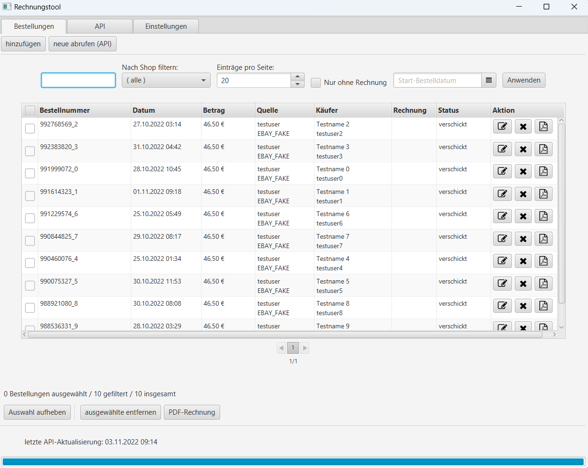
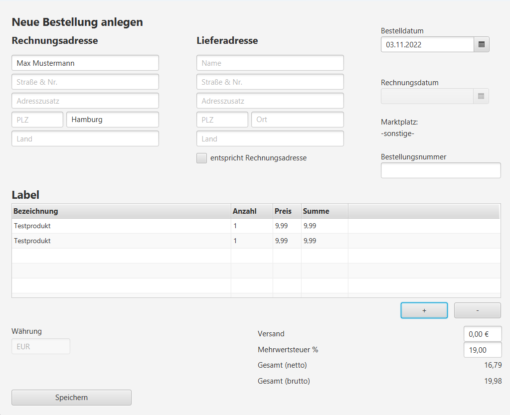
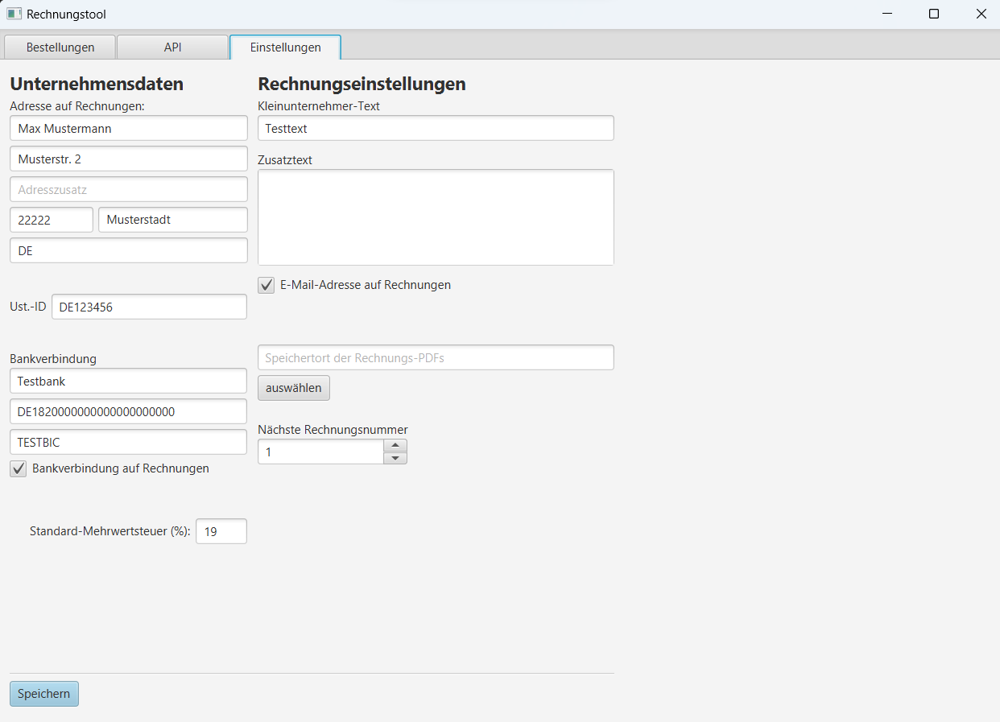

This is a demo app that was developed as a university project using Java / JavaFX and a local h2 database. It includes capabilities for inserting, editing, searching
and filtering shop orders.
Orders can be manually inserted or imported using a mock API service. Runs on Java SE 11.

